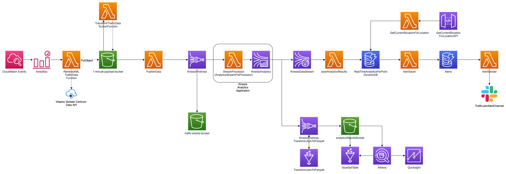

# Serverless data pipelines

## Architecture


Every minute a large blob of xml data is ingested from the API of the flemish traffic center.
This is a large file of about 8 MB.
The architecture allows the data to be streamed in near real time in small events.
These events are transformed and extracted from the big xml file and look like this:
```json
{
  "beschrijvende_id": "H221L20",
  "unieke_id": "622",
  "lve_nr": "50",
  "tijd_waarneming": "2020-04-07T11:30:00+01:00",
  "tijd_laatst_gewijzigd": "2020-04-07T11:31:21+01:00",
  "actueel_publicatie": "1",
  "beschikbaar": "1",
  "defect": "0",
  "geldig": "0",
  "verkeersintensiteit_klasse1": "0",
  "voertuigsnelheid_rekenkundig_klasse1": "0",
  "voertuigsnelheid_harmonisch_klasse1": "252",
  "verkeersintensiteit_klasse2": "1",
  "voertuigsnelheid_rekenkundig_klasse2": "125",
  "voertuigsnelheid_harmonisch_klasse2": "125",
  "verkeersintensiteit_klasse3": "0",
  "voertuigsnelheid_rekenkundig_klasse3": "0",
  "voertuigsnelheid_harmonisch_klasse3": "252",
  "verkeersintensiteit_klasse4": "0",
  "voertuigsnelheid_rekenkundig_klasse4": "0",
  "voertuigsnelheid_harmonisch_klasse4": "252",
  "verkeersintensiteit_klasse5": "0",
  "voertuigsnelheid_rekenkundig_klasse5": "0",
  "voertuigsnelheid_harmonisch_klasse5": "252",
  "rekendata_bezettingsgraad": "0",
  "rekendata_beschikbaarheidsgraad": "100",
  "rekendata_onrustigheid": "0"
}
```

The unique id can be linked back to a static list of measurement locations in Belgium.
Via this way it is possible to do real time analytics for traffic on all separate measurement locations in Belgium.

## Instruction

* set your profile and region in `serverless.yml`
* tail logs: `serverless logs -f functionName -t` eg: `serverless logs -f PublishTrafficData -t`
* invoke: `serverless invoke --function functionName --data "hello world"`
* invoke with log: `serverless invoke --function functionName --data "hello world" --log` eg: `serverless invoke --function RetrieveXMLTrafficData --data "hello world" --log` 
* deploy: `sls deploy -v`
`

## Data

* configuration of measurement locations: [http://miv.opendata.belfla.be/miv/configuratie/xml](http://miv.opendata.belfla.be/miv/configuratie/xml)
* xsd of data: [http://miv.opendata.belfla.be/miv-verkeersdata.xsd](http://miv.opendata.belfla.be/miv-verkeersdata.xsd)
* url to retrieve the data: [http://miv.opendata.belfla.be/miv/verkeersdata](http://miv.opendata.belfla.be/miv/verkeersdata)
* doc: [https://data.gov.be/nl/dataset/7a4c24dc-d3db-460a-b73b-cf748ecb25dc](https://data.gov.be/nl/dataset/7a4c24dc-d3db-460a-b73b-cf748ecb25dc)

**Voorbeeld configuratie meetpunt**:
```xml
<meetpunt unieke_id="229">
<beschrijvende_id>H291L10</beschrijvende_id>
<volledige_naam>Knooppunt Antwerpen Oost R1-E313</volledige_naam>
<Ident_8>A0130002</Ident_8>
<lve_nr>64</lve_nr>
<Kmp_Rsys>0,393</Kmp_Rsys>
<Rijstrook>R10</Rijstrook>
<X_coord_EPSG_31370>155843,5609</X_coord_EPSG_31370>
<Y_coord_EPSG_31370>211823,5989</Y_coord_EPSG_31370>
<lengtegraad_EPSG_4326>4,452390068</lengtegraad_EPSG_4326>
<breedtegraad_EPSG_4326>51,21633338</breedtegraad_EPSG_4326>
</meetpunt>
```

**Info over de klasses**:
* Voertuigklasse 1 = Deze voertuigklasse was voorzien voertuigen met geschatte lengte tussen 0m en 1,00m. vb. moto's.
De sporadische metingen in deze voertuigklasse zijn weinig tot niet betrouwbaar.
Deze gegevens worden door AWV en het verkeerscentrum niet meer gebruikt.
* Voertuigklasse 2 = Personenwagens = voertuigen met geschatte lengte tussen 1,00m en 4,90m 
* Voertuigklasse 3 = Bestelwagens = voertuigen met geschatte lengte tussen 4,90m en 6,90m 
* Voertuigklasse 4 = Ongelede vrachtwagens = voertuigen metvgeschatte lengte tussen 6,90m en 12,00m bv.:Vrachtwagen of trekker 
* Voertuigklasse 5 = Gelede vrachtwagens of bussen= voertuigen met geschatte lengte langer dan 12,00m bv.: vrachtwagen+aanhangwagen, trekker+aanhangwagen of bus